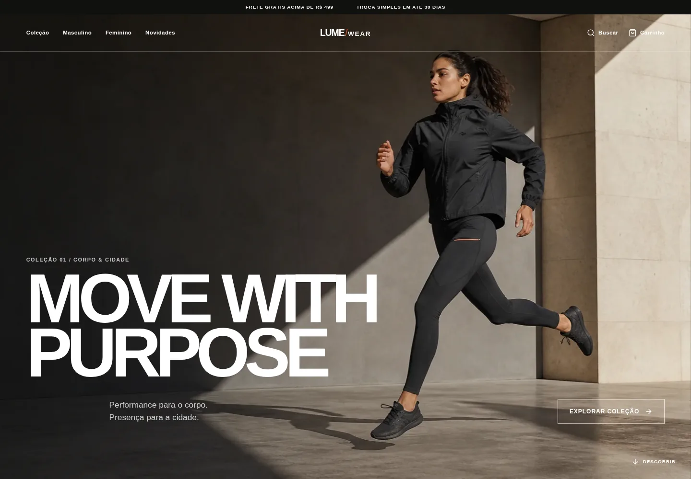
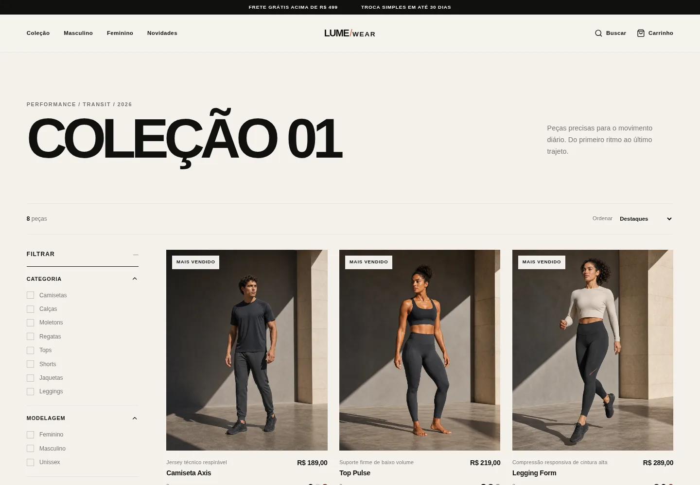
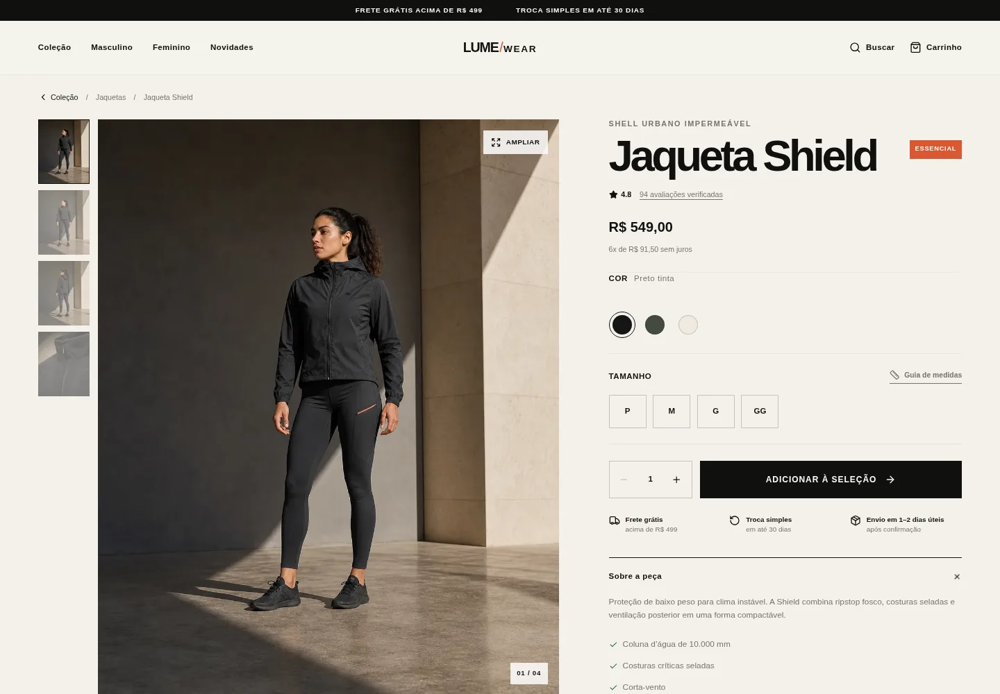
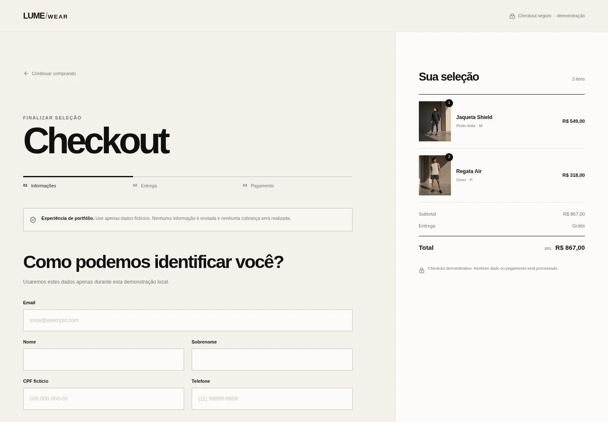
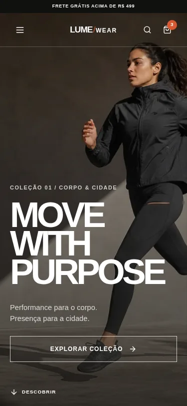
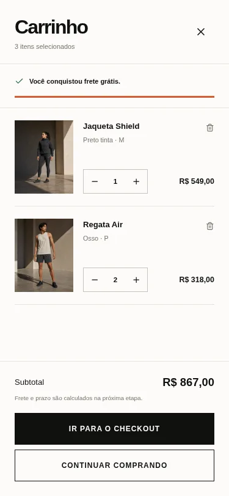

# Lume Wear

E-commerce frontend de uma marca fictícia premium de roupas esportivas e athleisure. O projeto combina performance, design e estilo urbano em uma experiência editorial construída com React e TypeScript.

> **Projeto demonstrativo para portfólio.** A Lume Wear é uma marca fictícia. Produtos, preços, estoque, avaliações, entrega e pedidos são simulações; nenhum pagamento é processado.

## Visão geral

O Lume Wear foi redesenhado como um produto completo — não apenas como uma landing page. A experiência preserva o fluxo de compra de ponta a ponta:

```text
Home → Coleção → Produto → Carrinho → Checkout → Confirmação
```

A identidade visual, os componentes e a direção fotográfica seguem o sistema documentado em [DESIGN.md](./DESIGN.md).

## Screenshots



| Catálogo | Página de produto |
| --- | --- |
|  |  |

| Checkout | Experiência mobile |
| --- | --- |
|  |   |

## Principais funcionalidades

- Home editorial com campanha, lançamentos, categorias por contexto de uso, manifesto, best sellers e newsletter demonstrativa.
- Catálogo responsivo com filtros de categoria, modelagem, preço, cor e tamanho.
- Filtros e ordenação refletidos na URL, permitindo compartilhar e restaurar uma seleção.
- Busca funcional por nome, categoria, descrição e atributos do produto.
- Cards com segunda fotografia no hover e estados adaptados para telas touch.
- Página de produto com galeria, lightbox, cores, tamanhos, estoque fictício, quantidade, guia de medidas e relacionados.
- Carrinho acessível em drawer, persistido no `localStorage`, com variantes, limite de estoque, quantidade, remoção e meta de frete grátis.
- Checkout em três etapas com validação visual, duas modalidades de frete, resumo responsivo e confirmação demonstrativa.
- Menu mobile, 404 localizado e páginas informativas de entrega, trocas, medidas e privacidade.
- SEO base, Open Graph, favicon próprio, HTML semântico e metadados por rota.
- Suporte a teclado, foco visível, labels, regiões anunciadas e `prefers-reduced-motion`.

## Direção visual e assets

A interface usa uma paleta curta de preto tinta, off-white mineral, grafite e laranja queimado. A composição privilegia escala tipográfica, linhas finas, espaço negativo e fotografia — sem sombras decorativas ou aparência de dashboard.

O acervo visual é original e foi produzido especificamente para este projeto:

- 2 imagens de campanha;
- 8 produtos coerentes;
- 4 enquadramentos por produto: campanha, frente, costas/lateral e detalhe;
- 32 imagens de catálogo em WebP, otimizadas para carregamento web;
- imagem Open Graph derivada da campanha principal.

Nenhum asset foi copiado de marcas esportivas reais.

## Stack

- React 18
- TypeScript em modo estrito
- Vite 7
- React Router
- React Hook Form + Zod
- Radix Dialog
- CSS responsivo + Tailwind CSS como camada de base
- Vitest + Testing Library
- Lucide Icons

## Arquitetura frontend

O projeto mantém uma arquitetura deliberadamente simples para o escopo de showcase:

- `data`: catálogo tipado e dados comerciais fictícios;
- `context`: estado global e persistência do carrinho;
- `lib`: regras puras de catálogo, checkout e formatação;
- `components`: blocos reutilizáveis separados por domínio;
- `pages`: composição das rotas e seus fluxos;
- `assets`: fotografia de campanha e catálogo já otimizada.

As páginas são carregadas sob demanda com `React.lazy`. O carrinho reidrata apenas IDs e variantes válidas do armazenamento local; os produtos continuam centralizados no catálogo. Filtros e ordenação são funções puras, o que facilita teste e evolução.

Não há backend, autenticação ou gateway de pagamento: essas camadas não são necessárias para o objetivo deste case.

## Estrutura de pastas

```text
.
├── docs/
│   └── screenshots/
├── public/
│   ├── favicon.svg
│   ├── og-lume.jpg
│   └── robots.txt
├── src/
│   ├── assets/
│   │   ├── campaign/
│   │   └── catalog/
│   ├── components/
│   │   ├── cart/
│   │   ├── collection/
│   │   ├── layout/
│   │   └── product/
│   ├── context/
│   ├── data/
│   ├── lib/
│   ├── pages/
│   ├── test/
│   ├── types/
│   ├── App.tsx
│   └── index.css
├── DESIGN.md
└── README.md
```

## Como executar

Requisitos: Node.js 20.19 ou superior e npm.

```bash
npm install
npm run dev
```

O Vite informa a URL local no terminal, normalmente `http://localhost:8080`.

## Qualidade e testes

```bash
npm run typecheck
npm run lint
npm test
npm run build
```

A suíte cobre regras de filtro e ordenação, busca normalizada, validação do checkout, persistência e limites de estoque do carrinho e o fluxo de seleção de tamanho até a abertura do carrinho.

## Build de produção

```bash
npm run build
npm run preview
```

Os arquivos finais são gerados em `dist/`. As rotas são divididas em chunks e as imagens abaixo da dobra usam carregamento tardio.

## Status

Case de portfólio funcional e responsivo. O fluxo principal está completo no frontend e foi revisado nos breakpoints de 375, 430, 768, 1024 e 1440 px.

Possíveis evoluções futuras incluem integração com um CMS de catálogo, testes E2E em CI, cálculo de frete real e uma API de pedidos — sempre mantendo o modo demonstrativo separado de qualquer operação comercial.
